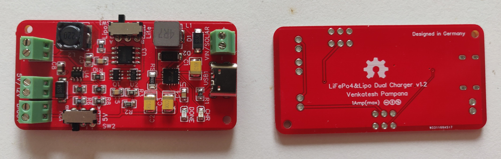
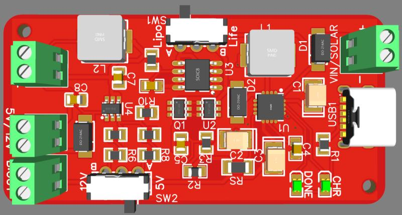

# MultichemistryLithiumBatteryCharger
Single Cell Li-ion/LiPo/Lifepo4 Battery charger with battery protection and 5v/12v output

 

## Features:
* Compatible with Li-ion/Lipo/Lifepo4 single cell batteries (Use SW1 to switch between li-ion and lifepo4)
* Built-in Battery protection circuit for Li-Ion/Lipo and Lifepo4 cells
* 1A Max Charge and discharge Current
* 5v/12v output with max 1A (use switch SW2)
* Solar input 4-6v 
* Max DC input 8V
* Direct battery output is also included for special applications
* Recommended solar cells as input: 5V (0.5watts - 4watts), 4V (0.5watts - 4watts), 5.5V (0.5watts - 4watts), 6V (0.5watts - 4watts)

 

